# Architecture du projet QuizzUp Backoffice

## Schéma global

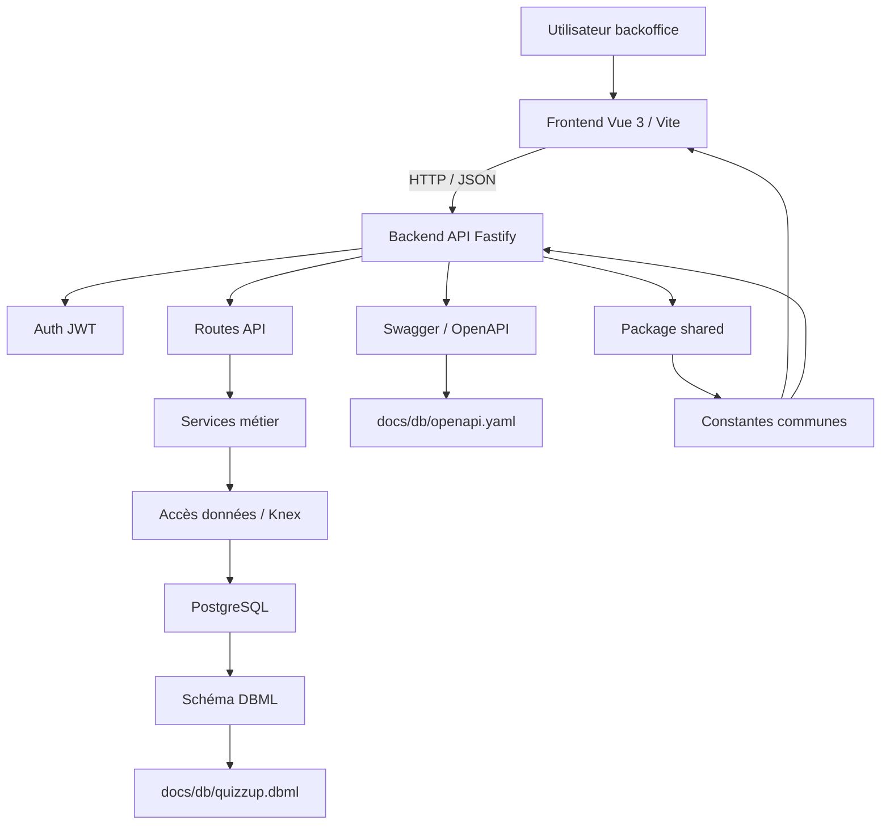

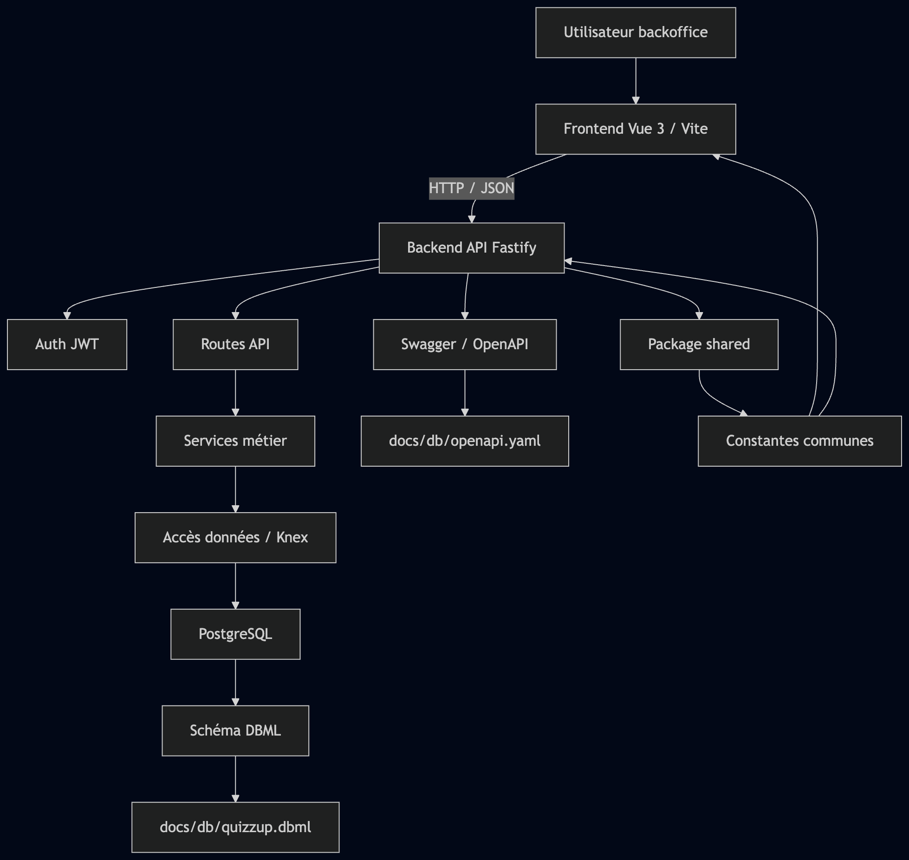

## Architecture backend

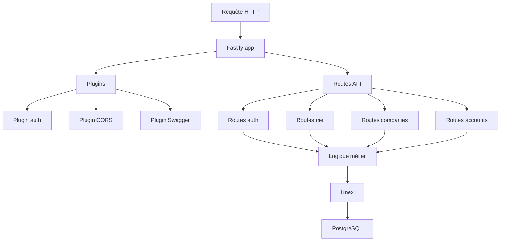

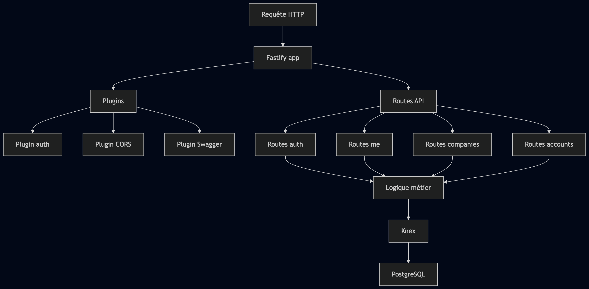

## Architecture frontend

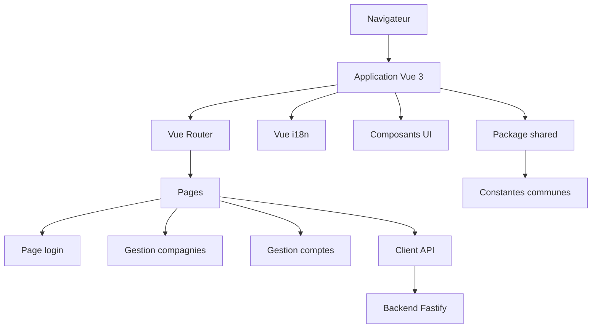

## Flux d'authentification

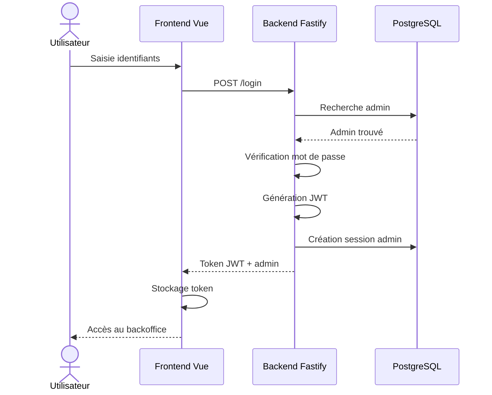

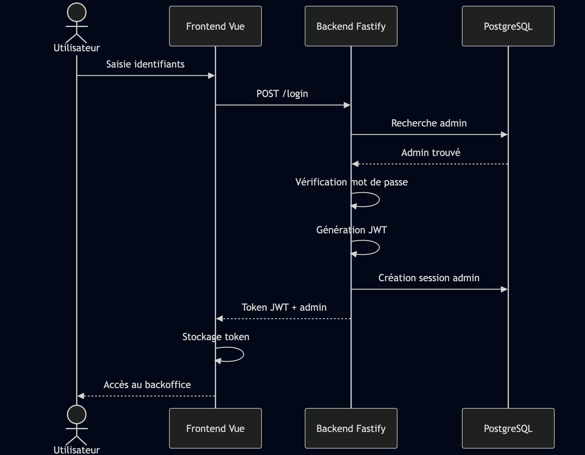

## Flux d'accès à une route protégée

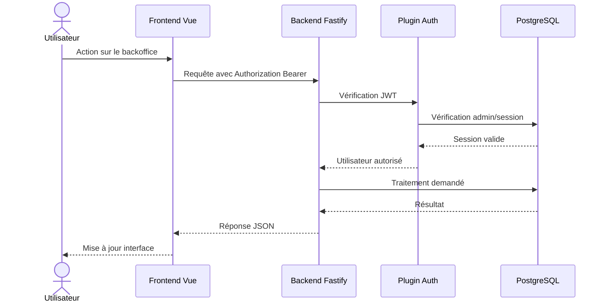

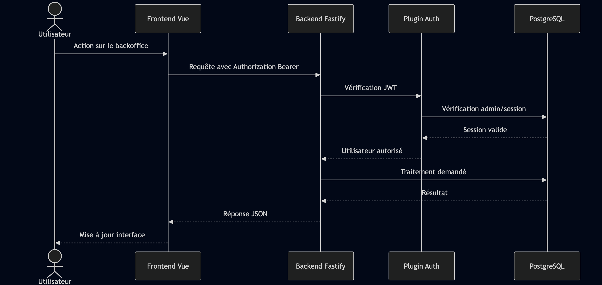

## Organisation documentaire

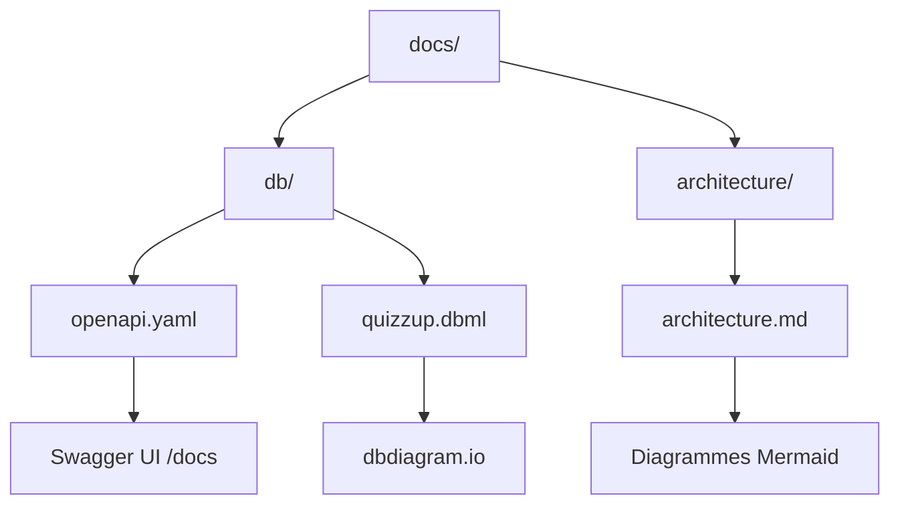

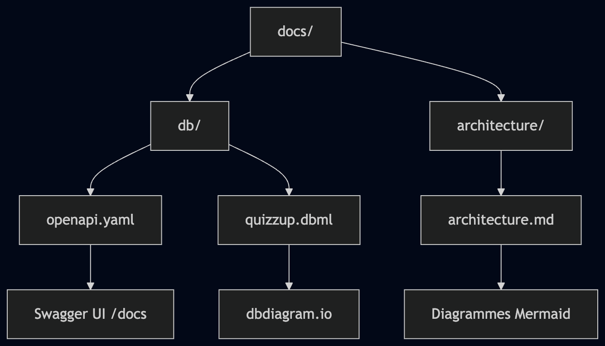
